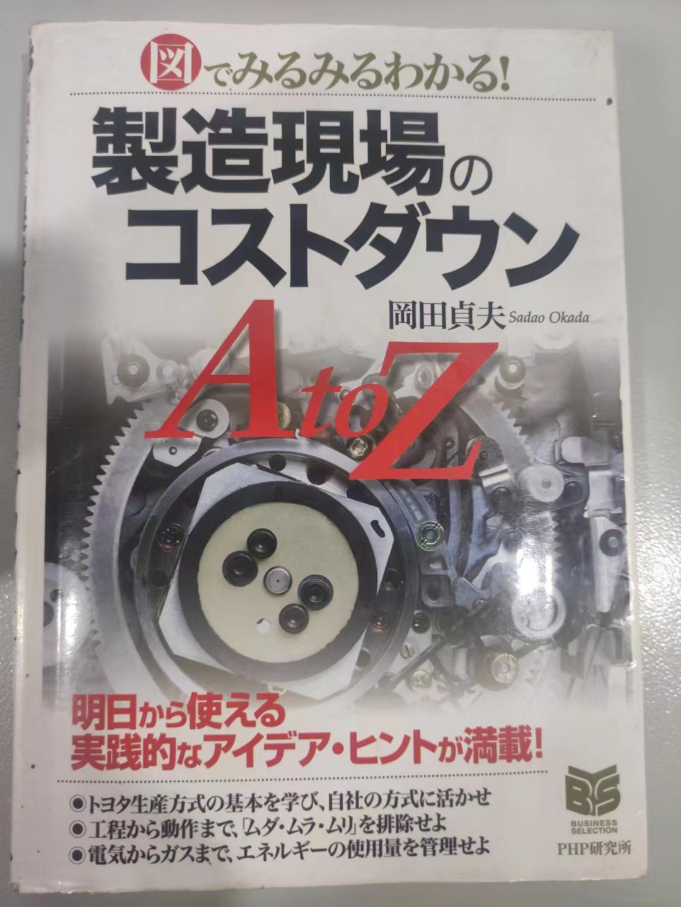

# moren
制造现场之降低成本A-Z

目录

**PART 1 思考方法与理论篇--降低成本前要牢记这一点**

第一章 掌握产品、零件的成本是提高利润的第一步

1-1 为什么现在必须进行cost-down？

1-2 产品和零件的成本是由什么决定的

1-3 探讨用什么方法降低核算线

1-4 削减固定费用

1-5 怎样做才能成为生产效率高的现场？

1-6 如何吸收人工费的上涨

1-7 生命周期成本的减低

1-8 以丰田生产方式为基准（指标）努力吧

1-9 头部出汗的改善

1-10 不要忽视间接部门的成本降低和生产性提高

第二章 建立符合现场的报价方法，算出适当的成本

2-1 用两种尺度把握本公司的成本

2-2 外产品价格的决定因素大致分为3个

2-3 有了成本表，成本决定就容易了

第三章 在现场进行的降低成本活动的步骤

3-1 领导带头，持续推进

3-2 从选择改善对象开始降低成本活动

3-3 创意思维 1

3-4 创意思维 2

3-5 组成团队，以达成目标成本为目标

3-6 每个单位都要明确“问题出在哪里”

3-7 首先是作业改善，其次是设备改善

3-8 从更好的客户那里以更便宜的价格购买

3-9 降低外部产品价格的措施

**PART2 实践篇--有效降低成本活动的具体方法**

第四章 应用改善方法，实践降低成本活动

4-1 选择适合本公司的有效的改善方法

4-2 用VE打破固定观念回到原点的想法

4-3 为什么-为什么-为什么的产品分析

4-4 与竞争对手的产品进行比较分析

4-5 在节能方面发挥威力的MAP手法

第五章 这样做的话，现场所有的无用功成本都能消除

5-1 重新审视现场的工作，消除无用功、不均衡、勉强

5-2 从工作中寻找降低成本的要素

5-3 操作经济的原则是改善的着眼点

5-4 增加赚钱的工作

5-5 效果目标一定要用数字表示

5-6 为了挖掘现场的浪费而进行的“兴道”

5-7 设定标准时间，提高竞争力

5-8 根据人机图进行等待/等待台数改善

5-9 发现容易忽略的设备损耗，消灭

5-10 提高开工率的秘诀

5-11 分析事物的流程，改善为有效率的布局

5-12  从小批量、1个流水线的转换

5-13 打造一条流水线的要点

5-14 以单元生产方式实现自我完结

5-15 消除“物留“创造利益

5-16 库存是最糟糕的浪费

5-17 不浪费的模具更换作业的方法

5-18 多能工业化和职场水平的提升息息相关

5-19 材料利用率的提高是在设计阶段下的功夫取得效果的

5-20 最大限度的利用材料的切割方案

5-21 加工作业的成本降低是这样做的

第六章 通过QC消除不良也有助于降低成本

6-1 QC方法的活用

6-2 彻底追究不良原因

6-3 零异品、零缺货

6-4 使全面检查合理化

6-5 外购产品的故障对策

第七章 节约能源和减少废弃物对保护环境有很大的帮助

7-1 我们还有很多可以减少能源消耗的地方

7-2全员参与推进节能

7-3 节约电费的着眼点

7-4 节约燃料、水、空气的关键

7-5 减少工厂内的废弃物

7-6 消费后产品的再资源化

索引

参考文献

